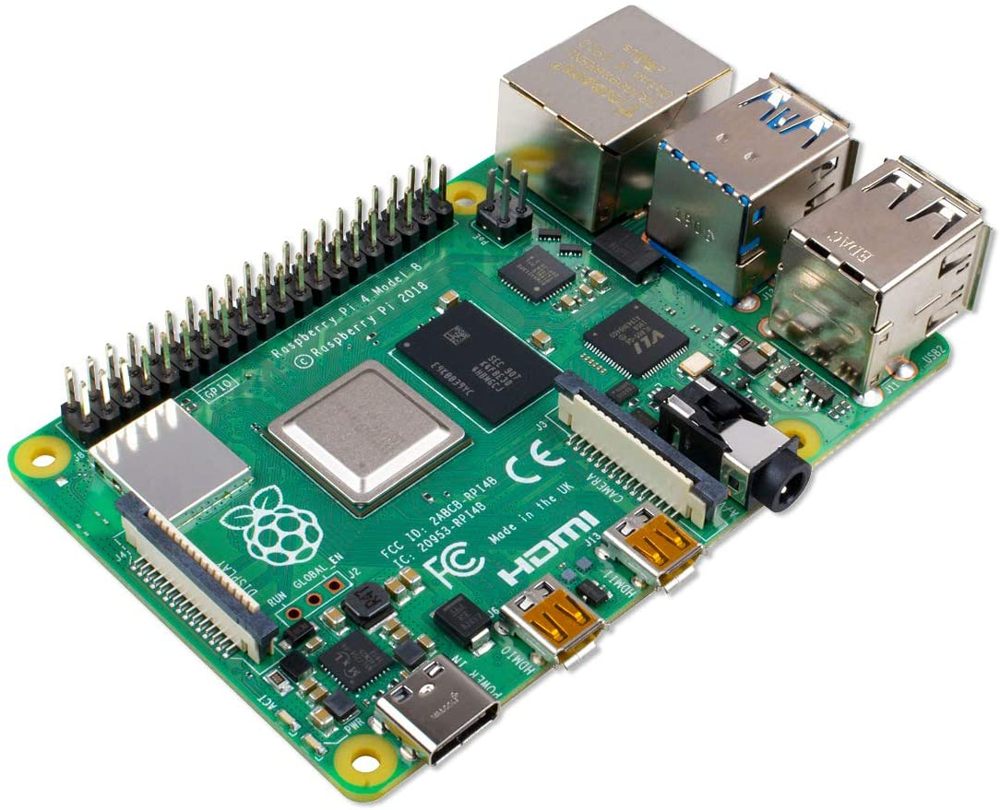

# MA_002 PROJECT (_Multisensor Alarm_)

## _DESCRIPTION_

_Our project want to increase security in a studio flat or two-room apartment. We want to create a Multisensor Alarm using some tools (scroll down to see their descriptions)._

### _How?_
_We use a **raspberry Pi** connected to **bluetooth sensors** placed on the sides of some doors of our apartment. Every time that someone **open or close a door** the sensors signal their **change of status** by sending data to raspberry Pi.
Raspberry Pi is connected to a website connected to sqlite database that stores some accounts, sensors, raspberry data. Through the website you can create accounts with email, password ecc., activate/deactivate an alarm, check the status of the sensors, log in, log out, sign up._

## _TOOLS_

### _Raspberry Pi 4:_

_Is a Microprocessor that has a personal OS called "Raspberry Pi OS" or "Raspbian". We use it as a client to manage sensors._

### _Door sensors IM20-BLE:_

_They are bluetooth sensor that we place on doors. They can send alarm report, tamper report, battery level status and heartbeat report._

### _Sqlite:_

_We use it to create database._

### _Javascript:_

_We use it to manage sensors on raspberry Pi 4 and to communicate with web server._

### _Python:_

_We use it to create web server._

### _Html & css:_

_We use them to create web sites._

## _TEAM MEMBERS_

### ___Acchiardi Paolo:___

  

  * _Roles:_  
    * _Security manager and database creator_
    * _Web server junior developer_
    * _Documentation handler_
  * _Profile: [GitHub](https://github.com/paoloacchiardi)_
### ___Agbonson Fabrizio:___

  

  * _Roles:_  
    * _Front-end developer_
  * _Profile: [GitHub](https://github.com/smilefabri)_
### ___Bassignana Francesco:___

  

  * _Roles:_  
    * _Project manager_
    * _Hardware manager_
    * _Client developer_
  * _Profile: [GitHub](https://github.com/francescoBassi2002)_

## _[RACI & WBS TABLES](https://docs.google.com/spreadsheets/d/1zHsK8yuXiTM8GkrUp1s9jzQNUywZxenSyhm5xKTKUP0/edit#gid=0)_

<!--- ## _WORK_

### _Database:_

_ER scheme -> _

_Mapping -> _

_Attributes Table -> _ -->

## _THANKS_

  * _[I.T.I.S Mario Delpozzo](https://www.itiscuneo.gov.it/)_
